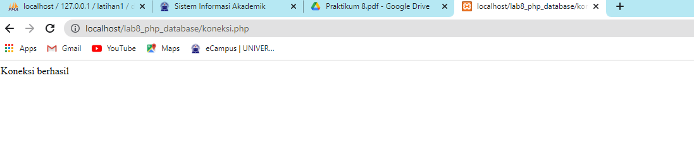
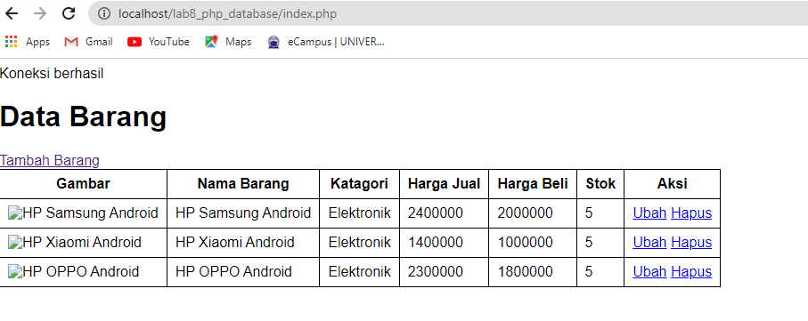
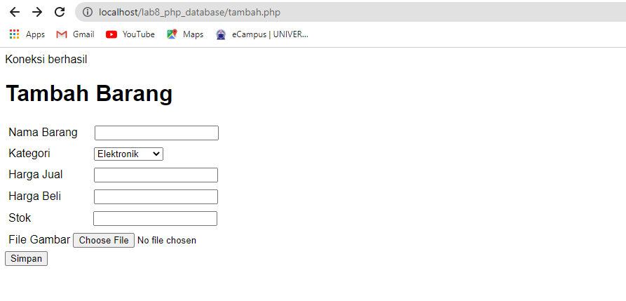
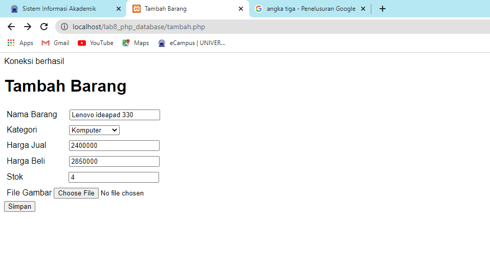
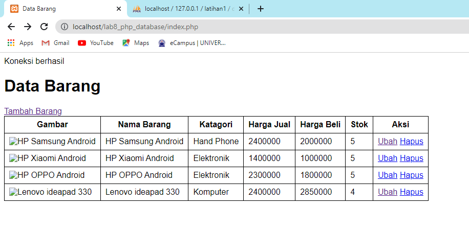
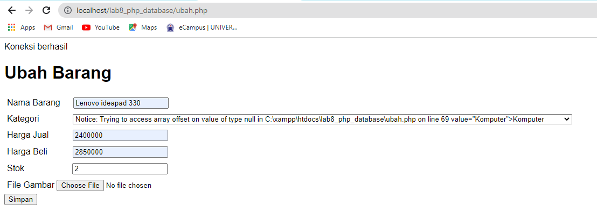
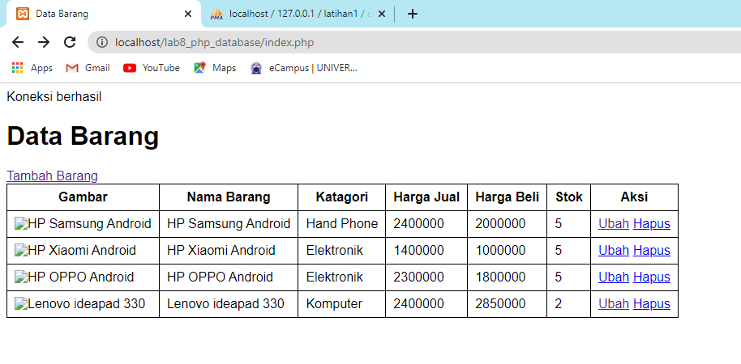
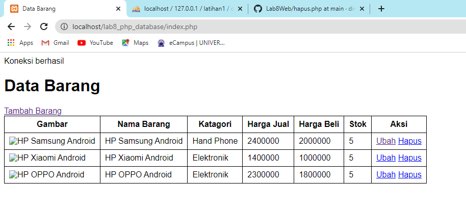

# PRAKTIKUM 8

**Nama : Reka Hani Latifah Nurhasanah** <br>

**Nim : 312010343** <br>

**Kelas : TI.20.A2** <br>

**Matkul : Pemrograman Web** <br>

# LAB8WEB

### Menjalankan MySQL Server 

Pastikan web server Apache dan MySQL server sudah dijalankan. Kemudian buka melalui browser. http://localhost/phpmyadmin/


### Membuat Database dan Menambahkan Tabel di Query SQL


### Memasukkan Data Barang di Query SQL


Hasil jika data berhasil di input


### Membuat program CRUD 

Buat folder `Lab8_php_database` pada root directory web server, kemudian akses pada web server dengan mengakses URL : http://localhost/Lab8_php_database/ seperti berikut


### Membuat File Koneksi Database

Membuat file baru dengan nama `koneksi.php` seperti berikut

`syntax`

```

<?php
$host = "localhost";
$user = "root";
$pass = "";
$db = "latihan1";
$conn = mysqli_connect($host, $user, $pass, $db);
if ($conn == false)
{
echo "Koneksi ke server gagal.";
die();
} #else echo "Koneksi berhasil";
?>

```

Buka melalui browser untuk menguji koneksi database (untuk menyampilkan pesan
koneksi berhasil, uncomment pada perintah echo “koneksi berhasil”;



### Membuat File Index Untuk Menampilkan Data (READ)

Membuat file baru dengan nama `index.php` seperti berikut

`syntax`

```

<?php
include("koneksi.php");
// query untuk menampilkan data
$sql = 'SELECT * FROM data_barang';
$result = mysqli_query($conn, $sql);

?>
<!DOCTYPE html>
<html lang="en">
<head>
    <meta charset="UTF-8">
    <link href="style.css" rel="stylesheet" type="text/css" />
    <title>Data Barang</title>
</head>
<body>
<div class="container">
    <h1>Data Barang</h1>
    <div class="main">
        <a href="tambah.php">Tambah Barang</a>
        <table>
        <tr>
        <th>Gambar</th>
        <th>Nama Barang</th>
        <th>Kategori</th>
        <th>Harga Jual</th>
        <th>Harga Beli</th>
        <th>Stok</th>
        <th>Aksi</th>
    </tr>
    <?php if($result): ?>
    <?php while($row = mysqli_fetch_array($result)): ?>
    <tr>
        <td>" alt="<?=$row['nama'];?>"></td>
        <td><?=$row['nama'];?></td>
        <td><?=$row['kategori'];?></td>
        <td><?=$row['harga_beli'];?></td>
        <td><?=$row['harga_jual'];?></td>
        <td><?=$row['stok'];?></td>
        <td>
            <a href="#">Ubah</a>
            <a href="#">Hapus</a>
    </tr>
    <?php endwhile; else: ?>
    <tr>
        <td colspan="7">Belum ada data</td>
    </tr>
    <?php endif; ?>
    </table>
    </div>
    </div>
</body>
</html>

```

Tampilan index



### Menambah Data (Create)

Membuat file baru dengan nama `tambah.php` seperti berikut

`syntax`

```


<?php
error_reporting(E_ALL);
include_once 'koneksi.php';

if (isset($_POST['submit']))
{
    $nama = $_POST['nama'];
    $kategori = $_POST['kategori'];
    $harga_jual = $_POST['harga_jual'];
    $harga_beli = $_POST['harga_beli'];
    $stok = $_POST['stok'];
    $file_gambar = $_FILES['file_gambar'];
    $gambar = null;

    if ($file_gambar['error'] == 0)
    {
        $filename = str_replace(' ', '_',$file_gambar['name']);
        $destination = dirname(__FILE__) .'/gambar/' . $filename;
        if(move_uploaded_file($file_gambar['tmp_name'], $destination))
        {
            $gambar = 'gambar/' . $filename;;
        }
    }
    
    $sql = 'INSERT INTO data_barang (nama, kategori, harga_jual, harga_beli, stok, gambar) ';
    $sql .= "VALUE ('{$nama}', '{$kategori}','{$harga_jual}','{$harga_beli}', '{$stok}', '{$gambar}')";
    $result = mysqli_query($conn, $sql);
    header('location: index.php');
}
?>

<!DOCTYPE html>
<html lang="en">
<head>
    <meta charset="UTF-8">
    <link href="style.css" rel="stylesheet" type="text/css" />
    <title>Tambah Barang</title>
</head>
<body>
<div class="container">
    <h1>Tambah Barang</h1>
    <div class="main">
        <form method="post" action="tambah.php" enctype="multipart/form-data">
            <div class="input">
                <label>Nama Barang</label>
                <input type="text" name="nama" style="margin-left: 20px;" />
            </div>
            <div class="input">
                <label>Kategori</label>
                <select name="kategori" style="margin-left: 58px;" >
                    <option value="Komputer">Komputer</option>
                    <option value="Elektronik">Elektronik</option>
                    <option value="Hand Phone">Hand Phone</option>
                </select>
            </div>
            <div class="input">
                <label>Harga Jual</label>
                <input type="text" name="harga_jual" style="margin-left: 40px;" />
            </div>
            <div class="input">
                <label>Harga Beli</label>
                <input type="text" name="harga_beli" style="margin-left: 43px;" />
            </div>
            <div class="input">
                <label>Stok</label>
                <input type="text" name="stok" style="margin-left: 85px;" />
            </div>
            <div class="input">
                <label>File Gambar</label>
                <input type="file" name="file_gambar" />
            </div>
            <div class="submit">
                <input type="submit" name="submit" value="Simpan" />
            </div>
        </form>
    </div>
</div>
</body>
</html>

```

Tampilan Tambah Barang



Form dari Tambah Barang



Hasil ketika berhasil di input



### Mengubah Data (Update)

Membuat file dengan nama `ubah.php`

`syntax`

```

<?php
error_reporting(E_ALL);
include_once 'koneksi.php';

if (isset($_POST['submit']))
{
    $id = $_POST['id'];
    $nama = $_POST['nama'];
    $kategori = $_POST['kategori'];
    $harga_jual = $_POST['harga_jual'];
    $harga_beli = $_POST['harga_beli'];
    $stok = $_POST['stok'];
    $file_gambar = $_FILES['file_gambar'];
    $gambar = null;

    if ($file_gambar['error'] == 0)
    {
        $filename = str_replace(' ', '_', $file_gambar['name']);
        $destination = dirname(__FILE__) . '/gambar/' . $filename;
        if (move_uploaded_file($file_gambar['tmp_name'], $destination))
        {
            $gambar = 'gambar/' . $filename;;
        }
    }


    $sql = 'UPDATE data_barang SET ';
    $sql .= "nama = '{$nama}', kategori = '{$kategori}', ";
    $sql .= "harga_jual = '{$harga_jual}', harga_beli = '{$harga_beli}', stok = '{$stok}' ";
    if (!empty($gambar))
        $sql .= ", gambar = '{$gambar}' ";
    $sql .= "WHERE id_barang = '{$id}'";
    $result = mysqli_query($conn, $sql);

    header('location: index.php');
    }
        
    $id = (isset($_POST['id']) ? $_POST['id'] : '');
    $sql = "SELECT * FROM data_barang WHERE id_barang = '{$id}'";
    $result = mysqli_query($conn, $sql);
    if (!$result) die('Error: Data tidak tersedia');
    $data = mysqli_fetch_array($result);

    function is_select($var, $val) {
        if ($var == $val) return 'selected="selected"';
        return false;
}
?>

<!DOCTYPE html>
<html lang="en">
<head>
    <meta charset="UTF-8">
    <link href="style.css" rel="stylesheet" type="text/css" />
    <title>Ubah Barang</title>
</head>
<body>
<div class="container">
    <h1>Ubah Barang</h1>
    <div class="main">
        <form method="post" action="ubah.php" enctype="multipart/form-data">
            <div class="input">
                <label>Nama Barang</label>
                <input type="text" name="nama" value="<?php echo $data['nama'];?>" style="margin-left: 20px;"/>
            </div>
            <div class="input">
                <label>Kategori</label>
                <select name="kategori" style="margin-left: 58px;">
                    <option <?php echo is_select ('Komputer', $data['kategori']);?> value="Komputer">Komputer</option>
                    <option <?php echo is_select ('Komputer', $data['kategori']);?> value="Elektronik">Elektronik</option>
                    <option <?php echo is_select ('Komputer', $data['kategori']);?> value="Hand Phone">Hand Phone</option>
                </select>
            </div>
            <div class="input">
                <label>Harga Jual</label>
                <input type="text" name="harga_jual" value="<?php echo $data['harga_jual'];?>" style="margin-left: 40px;"/>
            </div>
            <div class="input">
                <label>Harga Beli</label>
                <input type="text" name="harga_beli" value="<?php echo $data['harga_beli'];?>" style="margin-left: 43px;"/>
            </div>
            <div class="input">
                <label>Stok</label>
                <input type="text" name="stok" value="<?php echo $data['stok'];?>" style="margin-left: 85px;"/>
            </div>
            <div class="input">
                <label>File Gambar</label>
                <input type="file" name="file_gambar" />
            </div>
            <div class="submit">
                <input type="hidden" name="id" value="<?php echo $data['id_barang'];?>" />
                    <input type="submit" name="submit" value="Simpan" />
            </div>
        </form>
    </div>
</div>
</body>
</html>

```
Tampilan Ubah Barang



Sebelum data barang diubah


Setelah data barang diubah



### Menghapus Data (Delete)

Membuat file dengan nama `hapus.php`

`syntax`

```

<?php
include_once 'koneksi.php';
$id = $_GET['id'];
$sql = "DELETE FROM data_barang WHERE id_barang = '{$id}'";
$result = mysqli_query($conn, $sql);
header('location: index.php');
?>

```

Sebelum data barang dihapus


Setelah data barang dihapus

