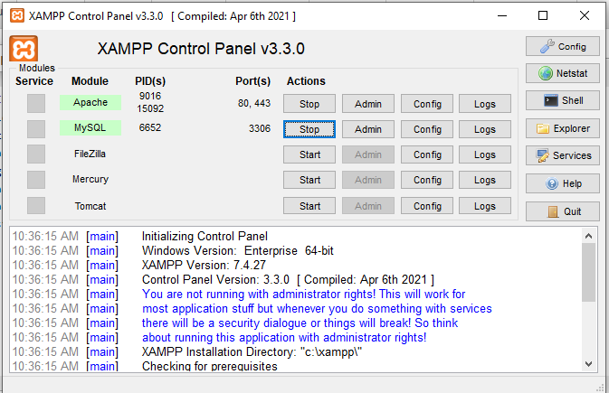
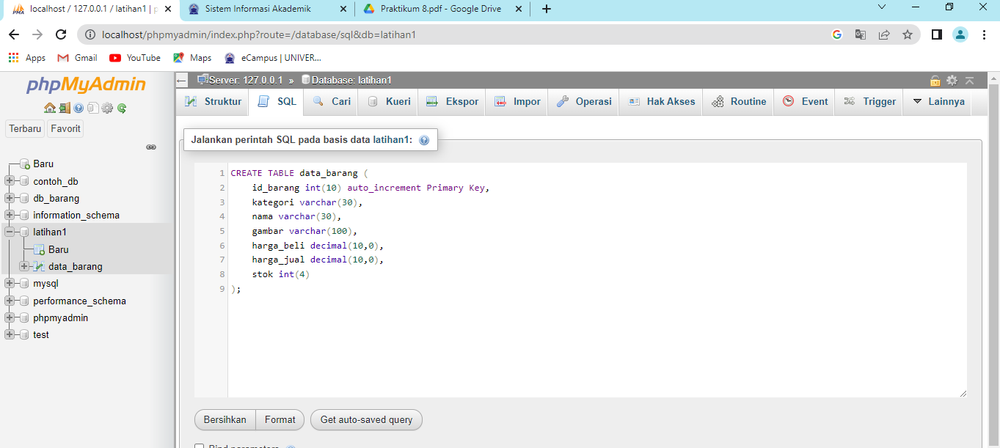
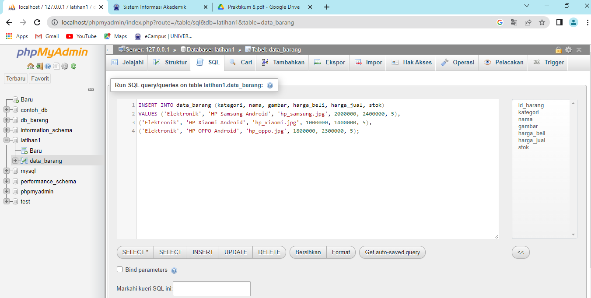
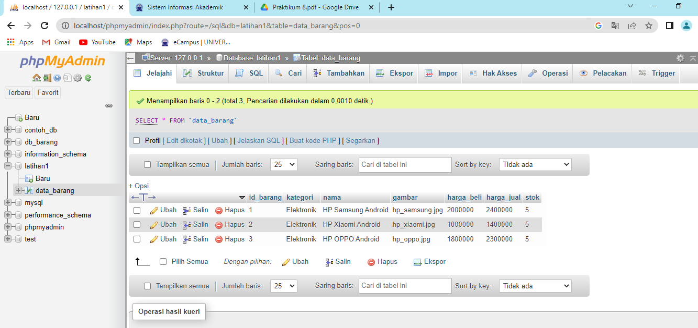
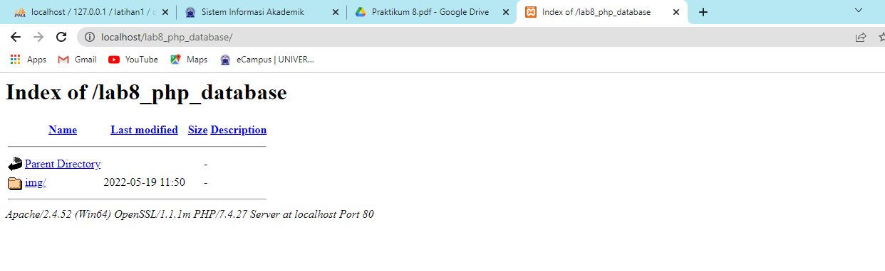

# PRAKTIKUM 8

**Nama : Reka Hani Latifah Nurhasanah** <br>

**Nim : 312010343** <br>

**Kelas : TI.20.A2** <br>

**Matkul : Pemrograman Web** <br>

# LAB8WEB

## Langkah 1

### Menjalankan MySQL Server 

Pastikan web server Apache dan MySQL server sudah dijalankan. Kemudian buka melalui browser. http://localhost/phpmyadmin/



## Langkah 2

### Membuat Database dan Menambahkan Tabel di Query SQL



## Langkah 3

### Memasukkan Data Barang di Query SQL



Hasil jika data berhasil di input



## Langkah 4

### Membuat program CRUD 

Buat folder `Lab8_php_database` pada root directory web server, kemudian akses pada web server dengan mengakses URL : http://localhost/Lab8_php_database/ seperti berikut



## Langkah 5

### Membuat File Koneksi Database

Membuat file baru dengan nama `koneksi.php` seperti berikut

`syntax`

```

<?php
$host = "localhost";
$user = "root";
$pass = "";
$db = "latihan1";
$conn = mysqli_connect($host, $user, $pass, $db);
if ($conn == false)
{
echo "Koneksi ke server gagal.";
die();
} #else echo "Koneksi berhasil";
?>

```

### Membuat File Index Untuk Menampilkan Data (READ)

Membuat file baru dengan nama `index.php` seperti berikut

`syntax`

```

